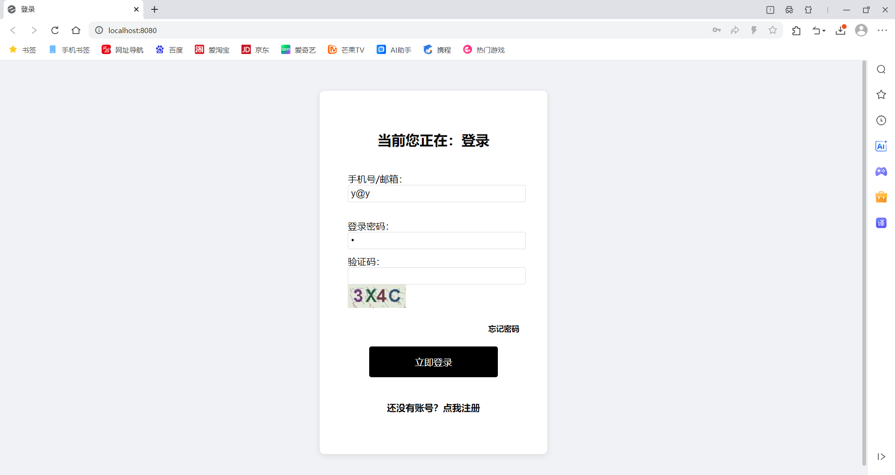

## 一、启动

直接在`idea`中用插件`tomcat7 - run`运行就可以了

sql表格调整较大，附上了建表脚本

---

## 二、登录

**管理员**账号密码

账号：18300000985 或 y@y

密码：1

**学生**账号密码

账号：18300000003 或 3@3

密码：333

账号：13600000004 或 4@4

密码：444

---

## 三、完成的功能

### 1、登录

* 没登录之前，直接在网址输入`/studentLogin.html`或`/adminLogin.html`或其他会跳转回登录界面
* 学生登录后，在网址修改为`/adminLogin.html`显示权限不足
* 管理员登录后，在网址修改为`/studentLogin.html`显示您是管理员
* 输入密码**3次错误**后，需要输入验证码（不分大小写）

### 2、注册

* 姓名，密码，邮箱不能过长
* 每次都需要输入验证码
* 注册完自动关闭注册

### 3、忘记密码

* 输入正确的账号（手机号/邮箱）就可以直接修改

### 4、管理员

#### 1.学生查询

#### 2.课程查询

##### 查询和修改可以混合使用

---

### 5、学生登录

